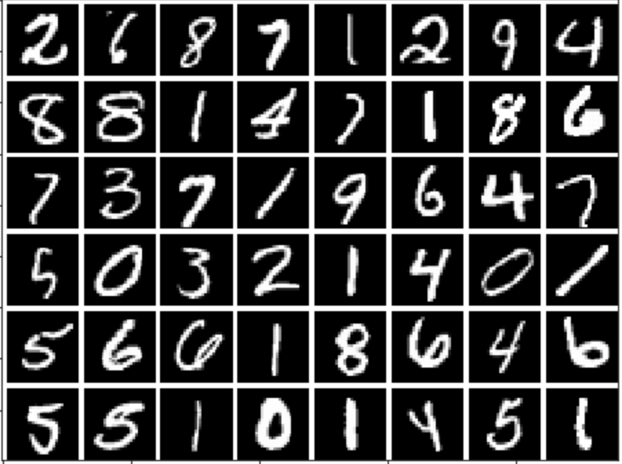
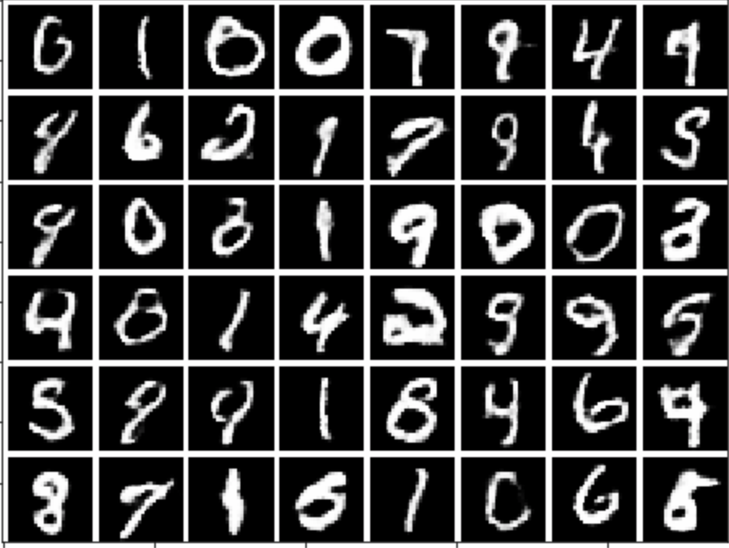

Generative Adversarial Networks in PyTorch
=======

About
--------

The repo is about the implementations of GAN, DCGAN, Improved GAN, LAPGAN, and InfoGAN in PyTorch.

My presentation about GANs' recent development (at 2017.01.17): [Presentation slides](https://docs.google.com/presentation/d/1HRNjCo_0PlspynoJKuoEF1AYkaKaUNgMzQ4nqiTlNUM/edit#slide=id.p)

Presented in the group meeting of Machine Discovery and Social Network Mining Lab, National Taiwan University.

Content
--------

- Generative Adversarial Nets (GAN): invented "adversarial nets" framework - a generative model G and a discriminative model D play a minimax two-player game.

- DC-GAN: proposed a set of constraints on the architectural topology of Convolutional GANs that make them stable to train in most settings.

- LAP-GAN: a cascade of generative models within a Laplacian pyramid framework to generate images in a coarse-to-fine fashion (high-resolution).

- Improved GAN (minibatch discrimination): allow the discriminator to look at multiple data examples in combination by incorporating the closeness between examples in a minibatch as side information.

- Info-GAN: an information-theoretic modification to the objective of Generative Adversarial Network that encourages it to learn interpretable and disentangled representations.

Example
---------

#### Sampled from MNIST dataset:

#### Generated by Improved GAN:

Usage
--------
Clone the repo and use the [virtualenv](http://www.virtualenv.org/):

    git clone https://github.com/AaronYALai/Generative_Adversarial_Networks_PyTorch

    cd Generative_Adversarial_Networks_PyTorch

    virtualenv venv

    source venv/bin/activate

Install pytorch and all dependencies and run the model (in Linux):

    pip install https://download.pytorch.org/whl/cu75/torch-0.1.10.post2-cp27-none-linux_x86_64.whl 

    pip install torchvision

    pip install -r requirements.txt

    cd GAN

    python run_GAN.py

More details about the installation about PyTorch: <http://pytorch.org>

References
--------

- GAN: I. Goodfellow, J. Pouget-Abadie, M. Mirza, B. Xu, D. Warde-Farley, S. Ozair, A. Courville, and Y. Bengio, “Generative adversarial nets,” NIPS, 2014.

- DC-GAN: Radford, Alec, Luke Metz, and Soumith Chintala. "Unsupervised representation learning with deep convolutional generative adversarial networks." arXiv 2015.

- LAP-GAN: Denton, Emily L., Soumith Chintala, and Rob Fergus. "Deep Generative Image Models using a Laplacian Pyramid of Adversarial Networks." NIPS 2015.

- Improved GAN: Salimans, T., Goodfellow, I., Zaremba, W., Cheung, V., Radford, A., & Chen, X. “Improved techniques for training gans.” NIPS 2016.

- Info-GAN: Chen, X., Duan, Y., Houthooft, R., Schulman, J., Sutskever, I., & Abbeel, P. “Infogan: Interpretable representation learning by information maximizing generative adversarial nets.” NIPS 2016.
